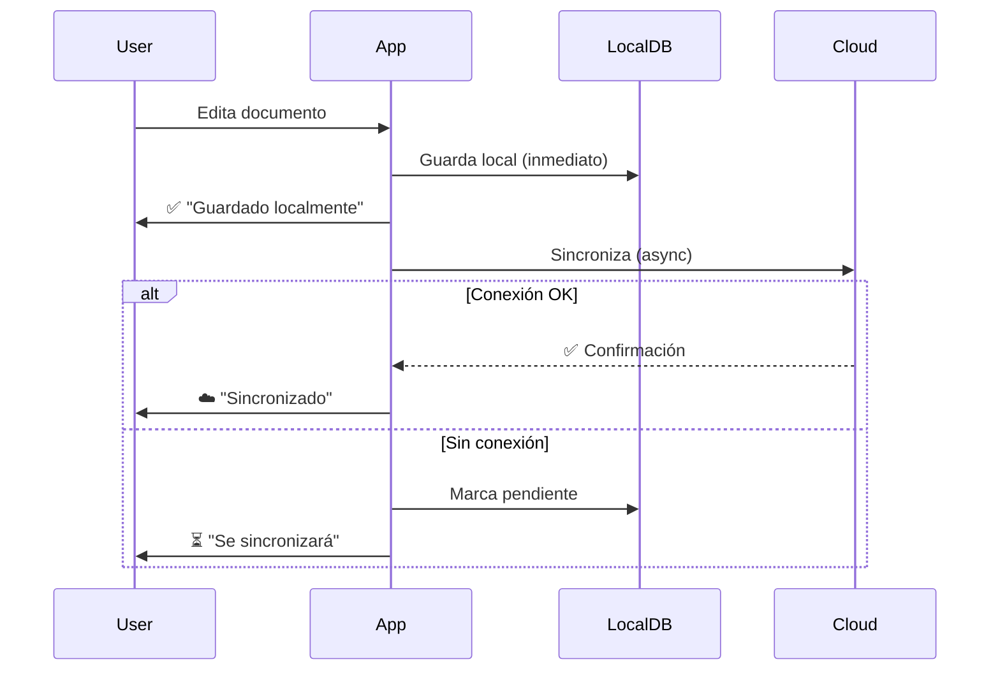

# PRD: AbogadoSoft - Sistema de Gestión Documental para Abogados Universitarios

> **Versión:** 1.0  
> **Fecha:** 27 de enero de 2026  
> **Plataforma:** Desktop (Electron + React SPA)

---

## 1. Resumen Ejecutivo

**AbogadoSoft** es una aplicación de escritorio desarrollada en Electron con React que permite a los abogados de una universidad gestionar documentos de forma colaborativa en una "nube privada". Diseñada específicamente para usuarios no técnicos y personas mayores, priorizando una experiencia intuitiva y accesible.

### Objetivos Principales
- 📁 Gestión colaborativa de documentos (CRUD compartido)
- ☁️ Sincronización automática nube/local
- 📊 Gestión de convenios universidad-abogados (Excel)
- 👴 Interfaz extremadamente amigable y accesible

---

## 2. Usuarios Objetivo

| Perfil | Características | Necesidades |
|--------|-----------------|-------------|
| **Abogados Senior** | 50-70 años, poca experiencia tech | Botones grandes, texto legible, flujos simples |
| **Abogados Junior** | 25-45 años, experiencia tech media | Eficiencia, atajos, funciones avanzadas |
| **Personal Administrativo** | Variado, uso básico de PC | Gestión de convenios, reportes |

---

## 3. Funcionalidades Core

### 3.1 📁 Gestión de Documentos (Home)

#### CRUD de Archivos
```
┌─────────────────────────────────────────────────┐
│  🏠 HOME - Mis Documentos                       │
├─────────────────────────────────────────────────┤
│  [📁 Nuevo]  [📤 Subir]  [🔍 Buscar...]         │
├─────────────────────────────────────────────────┤
│  ┌─────────┐ ┌─────────┐ ┌─────────┐           │
│  │   📄    │ │   📄    │ │   📄    │           │
│  │Contrato │ │Demanda  │ │Convenio │           │
│  │   .docx │ │   .pdf  │ │   .xlsx │           │
│  └─────────┘ └─────────┘ └─────────┘           │
└─────────────────────────────────────────────────┘
```

| Acción | Descripción |
|--------|-------------|
| **Crear** | Nuevo documento desde plantillas o en blanco |
| **Leer** | Visualización embebida en la app |
| **Actualizar** | Edición inline con auto-guardado |
| **Eliminar** | Papelera con recuperación (30 días) |
| **Compartir** | Asignar permisos a grupos/usuarios |

#### Sistema de Grupos
- Creación de grupos de trabajo
- Permisos granulares: `Lectura`, `Escritura`, `Admin`
- Invitación por código/email institucional

#### Sincronización Automática
```
[Documento] ←→ [Nube Privada] ←→ [Copia Local]
     ↓
[Auto-guardado cada 30 segundos]
[Sincronización al detectar cambios]
```

### 3.2 📝 Editor de Documentos Embebido

| Formato | Funcionalidad |
|---------|---------------|
| `.docx/.doc` | Edición completa (texto, tablas, imágenes) |
| `.pdf` | Visualización + anotaciones |
| `.xlsx/.xls` | Edición de hojas de cálculo |
| `.txt/.rtf` | Edición de texto plano/rico |

#### Características del Editor
- **Modo offline:** Edición sin conexión, sincroniza al reconectar
- **Historial de versiones:** Últimas 10 versiones
- **Exportar:** Local (.docx, .pdf) o imprimir directo
- **Extracción:** Descargar copia local sin afectar nube

### 3.3 📊 Gestión de Convenios (Excel)

Módulo especializado para convenios Universidad-Abogados:

```
┌─────────────────────────────────────────────────┐
│  📊 CONVENIOS                                   │
├─────────────────────────────────────────────────┤
│  Estado: [Todos ▼]  Año: [2026 ▼]  [🔍]        │
├─────────────────────────────────────────────────┤
│  # │ Convenio       │ Fecha  │ Estado │ Acción │
│ ───┼────────────────┼────────┼────────┼──────── │
│  1 │ Conv. UNAM-001 │ 15/Ene │ ✅ Act │ [Ver]  │
│  2 │ Conv. UAM-023  │ 03/Feb │ ⏳ Pen │ [Ver]  │
│  3 │ Conv. IPN-112  │ 20/Mar │ ❌ Ven │ [Ver]  │
└─────────────────────────────────────────────────┘
```

| Campo | Tipo | Descripción |
|-------|------|-------------|
| Número de convenio | Texto | Identificador único |
| Institución | Texto | Universidad/entidad |
| Fecha inicio | Fecha | Inicio de vigencia |
| Fecha fin | Fecha | Vencimiento |
| Responsable | Texto | Abogado asignado |
| Estado | Enum | Activo/Pendiente/Vencido |
| Documentos adjuntos | Archivos | Links a documentos |
| Notas | Texto largo | Observaciones |

---

## 4. Diseño UX/UI - Principios de Accesibilidad

### 4.1 Principios Fundamentales

> [!IMPORTANT]
> Este software está diseñado para usuarios NO técnicos. Cada decisión de UI debe pasar la prueba: "¿Mi abuela podría usarlo sin ayuda?"

#### Reglas de Oro
1. **Botones grandes** (mínimo 48x48px, ideal 64x64px)
2. **Texto legible** (mínimo 16px, títulos 24px+)
3. **Alto contraste** (ratio mínimo 4.5:1)
4. **Iconos + texto** (nunca solo iconos)
5. **Confirmaciones claras** (diálogos explícitos)
6. **Sin jerga técnica** ("Guardar" no "Commit")

### 4.2 Paleta de Colores

```css
/* Colores principales */
--primary: #2563EB;      /* Azul institucional - Confianza */
--success: #16A34A;      /* Verde - Éxito/Confirmación */
--warning: #F59E0B;      /* Naranja - Atención */
--danger: #DC2626;       /* Rojo - Eliminación/Error */
--neutral: #6B7280;      /* Gris - Texto secundario */

/* Fondos */
--bg-primary: #FFFFFF;   /* Fondo principal - limpio */
--bg-secondary: #F8FAFC; /* Fondo secundario - sutil */
--bg-card: #FFFFFF;      /* Tarjetas con sombra suave */
```

### 4.3 Componentes UI Clave

#### Navegación Simplificada
```
┌──────────────────────────────────────────────────┐
│  🏛️ AbogadoSoft                    👤 Juan Pérez │
├──────────────────────────────────────────────────┤
│                                                  │
│  ┌──────────┐  ┌──────────┐  ┌──────────┐       │
│  │   🏠     │  │   📊     │  │   ⚙️     │       │
│  │   Home   │  │Convenios │  │  Config  │       │
│  └──────────┘  └──────────┘  └──────────┘       │
│                                                  │
└──────────────────────────────────────────────────┘
```

#### Acciones con Confirmación
```
┌────────────────────────────────────┐
│  ⚠️ ¿Eliminar este documento?      │
│                                    │
│  "Contrato_2026.docx" se moverá   │
│  a la papelera por 30 días.       │
│                                    │
│  [Cancelar]      [Sí, Eliminar]   │
└────────────────────────────────────┘
```

#### Retroalimentación Visual
- ✅ Guardado exitoso: Toast verde con checkmark
- ⏳ Sincronizando: Spinner con texto "Guardando..."
- ❌ Error: Mensaje rojo con solución sugerida

### 4.4 Accesibilidad

| Característica | Implementación |
|----------------|----------------|
| **Teclado** | Navegación completa con Tab/Enter/Esc |
| **Screen Reader** | ARIA labels en todos los elementos |
| **Zoom** | Soporta hasta 200% sin romper layout |
| **Contraste** | Modo alto contraste opcional |
| **Tipografía** | Fuente configurable (tamaño/tipo) |

---

## 5. Arquitectura Técnica

### 5.1 Stack Tecnológico

```
┌─────────────────────────────────────────────────┐
│                 Frontend (Renderer)             │
├─────────────────────────────────────────────────┤
│  React 18 + TypeScript                         │
│  React Router (SPA navigation)                 │
│  TanStack Query (data fetching/cache)          │
│  Zustand (state management)                    │
│  Lucide React (iconos)                         │
└─────────────────────────────────────────────────┘
                        │
                        ▼
┌─────────────────────────────────────────────────┐
│                 Electron Main Process           │
├─────────────────────────────────────────────────┤
│  Node.js + Electron 28+                        │
│  SQLite (base de datos local)                  │
│  Chokidar (file watching)                      │
│  Auto-updater (actualizaciones)                │
└─────────────────────────────────────────────────┘
                        │
                        ▼
┌─────────────────────────────────────────────────┐
│                 Backend/Nube                    │
├─────────────────────────────────────────────────┤
│  Firebase/Supabase (autenticación + storage)   │
│  Realtime sync (Firestore/Realtime DB)         │
│  Cloud Functions (lógica serverless)           │
└─────────────────────────────────────────────────┘
```

### 5.2 Estructura del Proyecto

```
abogado-soft/
├── src/
│   ├── main/                  # Electron main process
│   │   ├── index.ts
│   │   ├── database/          # SQLite local
│   │   ├── sync/              # Sincronización nube
│   │   └── ipc/               # IPC handlers
│   │
│   ├── renderer/              # React SPA
│   │   ├── App.tsx
│   │   ├── pages/
│   │   │   ├── Home/          # Dashboard documentos
│   │   │   ├── Convenios/     # Gestión Excel
│   │   │   ├── Editor/        # Editor embebido
│   │   │   └── Settings/      # Configuración
│   │   ├── components/
│   │   │   ├── ui/            # Componentes base
│   │   │   ├── documents/     # Componentes de docs
│   │   │   └── layout/        # Header, Sidebar, etc.
│   │   ├── hooks/
│   │   ├── services/
│   │   ├── stores/            # Zustand stores
│   │   └── styles/
│   │
│   └── shared/                # Tipos compartidos
│       └── types/
│
├── electron-builder.json
├── package.json
├── vite.config.ts
└── tsconfig.json
```

### 5.3 Flujo de Sincronización



---

## 6. Modelo de Datos

### 6.1 Entidades Principales

```typescript
// Usuario
interface User {
  id: string;
  email: string;
  name: string;
  role: 'admin' | 'abogado' | 'asistente';
  avatarUrl?: string;
  createdAt: Date;
  lastLogin: Date;
}

// Documento
interface Document {
  id: string;
  name: string;
  type: 'docx' | 'pdf' | 'xlsx' | 'txt';
  size: number;
  path: string;           // Path local
  cloudUrl: string;       // URL en nube
  ownerId: string;
  groupId?: string;
  permissions: Permission[];
  version: number;
  createdAt: Date;
  updatedAt: Date;
  deletedAt?: Date;       // Soft delete
}

// Grupo
interface Group {
  id: string;
  name: string;
  description?: string;
  ownerId: string;
  members: GroupMember[];
  createdAt: Date;
}

interface GroupMember {
  userId: string;
  role: 'admin' | 'editor' | 'viewer';
  joinedAt: Date;
}

// Convenio (Excel)
interface Convenio {
  id: string;
  numero: string;
  institucion: string;
  fechaInicio: Date;
  fechaFin: Date;
  responsableId: string;
  estado: 'activo' | 'pendiente' | 'vencido';
  documentos: string[];     // IDs de documentos
  notas: string;
  createdAt: Date;
  updatedAt: Date;
}

// Permisos
interface Permission {
  userId?: string;
  groupId?: string;
  level: 'read' | 'write' | 'admin';
}
```

---

## 7. Roadmap de Desarrollo

### Fase 1: MVP (4-6 semanas)
- [ ] Setup proyecto Electron + React + TypeScript
- [ ] Autenticación básica (login/logout)
- [ ] CRUD documentos (subir, ver lista, eliminar)
- [ ] Visualización de documentos (PDF/DOCX básico)
- [ ] Almacenamiento local (SQLite)
- [ ] UI base con componentes accesibles

### Fase 2: Colaboración (3-4 semanas)
- [ ] Sistema de grupos
- [ ] Permisos y compartir documentos
- [ ] Sincronización con nube (Firebase/Supabase)
- [ ] Notificaciones de cambios

### Fase 3: Edición Avanzada (3-4 semanas)
- [ ] Editor DOCX embebido (OnlyOffice/Tiptap)
- [ ] Anotaciones PDF
- [ ] Historial de versiones
- [ ] Auto-guardado inteligente

### Fase 4: Convenios (2-3 semanas)
- [ ] Módulo de convenios
- [ ] Importar/exportar Excel
- [ ] Alertas de vencimiento
- [ ] Reportes básicos

### Fase 5: Polish (2 semanas)
- [ ] Onboarding guiado
- [ ] Atajos de teclado
- [ ] Modo offline robusto
- [ ] Actualizaciones automáticas

---

## 8. Métricas de Éxito

| Métrica | Objetivo |
|---------|----------|
| **Tiempo de onboarding** | < 5 minutos |
| **Tasa de completación de tareas** | > 95% |
| **Errores de usuario** | < 2 por sesión |
| **Tiempo para guardar documento** | < 2 segundos |
| **Disponibilidad offline** | 100% funciones core |

---

## 9. Consideraciones Adicionales

### Seguridad
- Encriptación de documentos en reposo
- Autenticación 2FA opcional
- Logs de auditoría
- Backup automático diario

### Rendimiento
- Lazy loading de documentos
- Caché inteligente
- Compresión de archivos
- Indexación para búsqueda rápida

### Soporte
- Tutorial interactivo integrado
- Tooltips explicativos
- Centro de ayuda offline
- Soporte por chat (opcional)

---

## 10. Apéndice: Referencias de Diseño

### Inspiración UI
- Notion (simplicidad)
- Google Drive (gestión de archivos)
- Microsoft 365 (editor de documentos)
- Dropbox Paper (colaboración)

### Fuentes
- **Títulos:** Inter (bold, 24-32px)
- **Cuerpo:** Inter (regular, 16-18px)
- **Monospace:** JetBrains Mono (código)

---

> [!NOTE]
> Este PRD es un documento vivo. Se actualizará conforme avance el proyecto y se reciba feedback de usuarios piloto.
